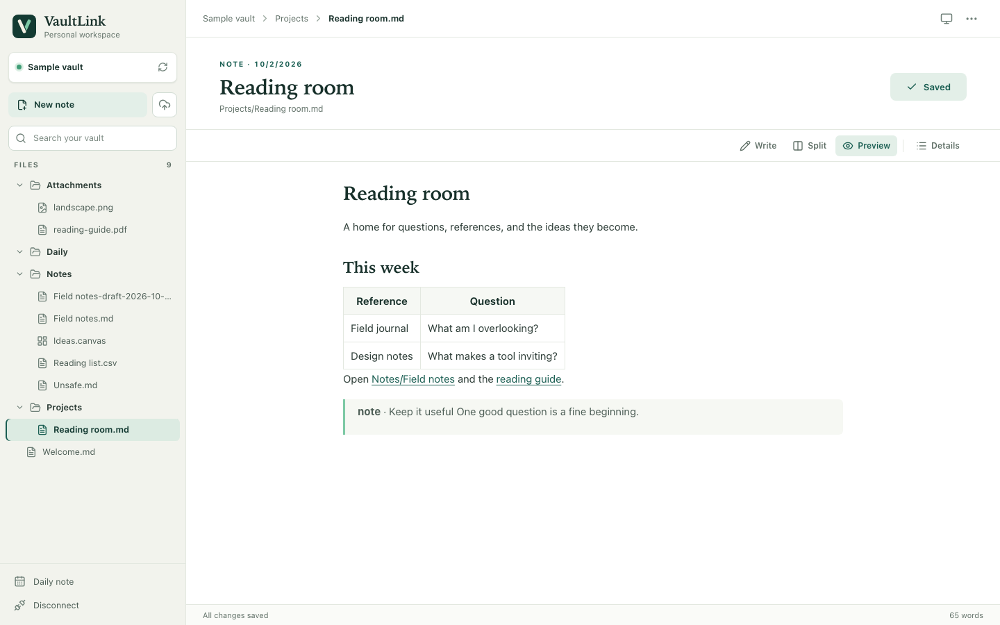
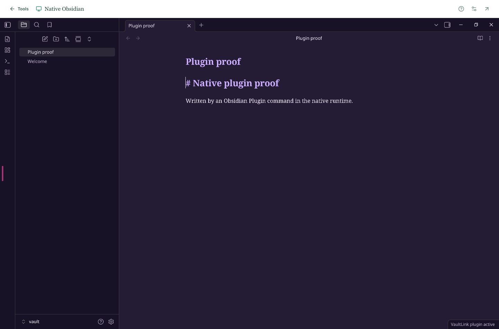

# VaultLink

**Your Obsidian vault, beside the web.** VaultLink gives you two ways to work with the same ordinary vault files:

| Choose | What opens | Best for |
| --- | --- | --- |
| **VaultLink workspace** | A focused browser editor and optional Chromium sidebar | Notes, search, Markdown preview, PDF markup, image copies, and quick work from another device |
| **Native Obsidian desktop** | The real Linux Obsidian app streamed into your browser | Vault themes and community plugins that work in that Linux environment |

The workspace has its own editor; it does **not** run Obsidian themes or plugins. The native desktop opens the vault's `.obsidian` settings, though plugins that need a particular operating system, external program, or device may behave differently. These are separate sessions and addresses.



[Download the latest release](https://github.com/baney75/vaultlink/releases/latest) · [Verification and limits](docs/VERIFICATION.md) · [Design](docs/DESIGN.md)

## Quick start

You need [Node.js 22.12 or newer](https://nodejs.org/) on the macOS or Linux computer that holds your vault. Windows companion setup has not been verified. From the [latest release](https://github.com/baney75/vaultlink/releases/latest), download `vaultlink-<version>-companion.zip`, extract the whole zip into a folder, and run:

```sh
node setup.mjs
```

Enter the path to your vault. Press Enter at the Tailscale question if you only need this computer. Setup starts a local companion and prints a browser address and pairing token. Open the address, enter both values in the connection screen, open a note, add a line, save, and reopen it to confirm the change. Keep the terminal open while using VaultLink; **Ctrl+C** stops it. The zip already contains the browser app and Node companion, so this path needs no `npm install`.

The pairing token is a password for the exposed vault. Setup keeps it in a private file under `~/.vaultlink`; keep it off shared screens and out of notes. The browser keeps it for the current session. A different local editor may still have unsaved changes that VaultLink cannot see, so save or close that editor before changing the same note here. VaultLink detects changes already saved to disk and offers conflict recovery.

### Add the Chromium sidebar

The full browser page works without an extension. For the sidebar, extract `vaultlink-<version>-chromium.zip` into its own folder. In Chrome open `chrome://extensions` (or `edge://extensions` in Edge), turn on **Developer mode**, choose **Load unpacked**, and select that extracted folder. Click the VaultLink icon, then connect with the same address and token. The extension can request access to that companion address; it has no page content scripts. Chromium 116+ and a working Side Panel API are required. Firefox and Safari packages are not included.

### Open the workspace on another device

Install and sign in to [Tailscale](https://tailscale.com/download) on the vault computer and the other device. Restrict your tailnet access rules to the devices or identities allowed to reach the vault computer. On the vault computer, while the companion runs:

```sh
tailscale serve --bg --https=8443 http://127.0.0.1:27124
tailscale serve status
```

Restart `node setup.mjs` and enter the private `https://...ts.net:8443` address printed by Serve. Open that address on the other device and enter the pairing token. The companion still listens only on loopback and still requires the token. Use Tailscale **Serve**, not Funnel. To remove the route, run `tailscale serve --https=8443 off`. See [Tailscale Serve](https://tailscale.com/docs/features/tailscale-serve) for HTTPS and access-rule prerequisites.

## Use the native Obsidian desktop

This option runs LinuxServer's Obsidian container on a Linux host with Docker Compose and Tailscale. It uses a **different** HTTPS address and a desktop login password, not the VaultLink pairing token. The container sees only the vault folder and a separate persistent config folder. Follow the [native setup guide](native/README.md) and fill [the environment template](native/.env.example); the supplied [Compose file](native/compose.yaml) binds HTTP to `127.0.0.1:27125` for a private Tailscale HTTPS proxy on port 8444. It does not start or configure a service by itself.

After starting the container and private Serve route, open its `https://...ts.net:8444` address, sign in, and choose `/vault` in Obsidian. Confirm a note, theme, and plugin that matter to you. Close other writers to the same unsynced vault during this first check. Native plugin compatibility depends on the Linux environment and has not been established for every plugin.



## What the VaultLink workspace supports

| File | Available tools |
| --- | --- |
| Markdown | Source editor, reading preview, split view, wiki links, local images, outline, and saved-file conflict handling |
| Text, JSON, CSV | Source editing with revision checks |
| PDF | Page viewing, text and highlight overlays, rotation, removal, and a new PDF copy |
| Browser-supported raster image | Crop, rotate, flip, resize, and export a new PNG or JPEG copy |
| Obsidian Canvas | View the canvas and edit supported text nodes |
| Audio and video | Playback when the browser supports the codec |

PDF tools do not rewrite existing PDF text or securely redact content. Image exports flatten layers and may discard metadata or animation. Attachment transformations save copies and preserve originals. Dataview queries, Bases, Excalidraw, and plugin views are not rendered as native Obsidian features in the workspace.

Existing note bytes are backed up outside the exposed vault tree before replacement. Hidden folders, including `.obsidian`, are not served by the workspace API. Keep normal vault backups and see [security boundaries](SECURITY.md) before connecting a sensitive vault.

## Build from source

For contributors, a source checkout uses npm:

```sh
npm ci
npm run check
npm run demo
```

The demo makes a synthetic vault under `.private/demo-vault`; open `http://127.0.0.1:27124` and use the sample token printed in the terminal. Re-running the demo resets those samples. `npm run setup` runs the source companion against a vault you choose after building. `npm run package` builds the browser app and produces both release zips plus `release/SHA256SUMS`. Browser tests use `npx playwright install chromium` followed by `npm run test:e2e`. The [protocol](docs/PROTOCOL.md) describes the local API.

VaultLink is independent of Obsidian and Tailscale. See [LICENSE](LICENSE) for licensing terms.
